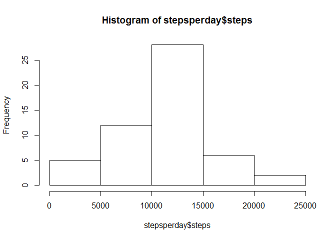
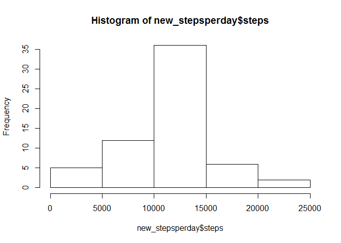

# Reproducible Research: Peer Assessment 1


## Loading and preprocessing the data


```r
activity <- read.csv("activity.csv")
stepsperday <- aggregate(steps ~ date, data = activity ,sum, na.rm =TRUE)
avstepsperinterval <- aggregate(steps ~ interval, data = activity ,mean, na.rm =TRUE)
```


## What is mean total number of steps taken per day?

*Make a histogram of the total number of steps taken each day

```r
hist(stepsperday$steps)
```



*Calculate and report the mean and median of the total number of steps taken per day


```r
mean(stepsperday$steps)
```

```
## [1] 10766.19
```

```r
median(stepsperday$steps)
```

```
## [1] 10765
```

The average steps per day is  10766.19
The median is 10765

## What is the average daily activity pattern?

* Time series plot : 

```r
plot(steps ~ interval, data = avstepsperinterval, type = "l")
```


* The 5-minute interval, on average across all the days in the dataset than contains the maximum number of steps


```r
avstepsperinterval[which.max(avstepsperinterval$steps), ]$interval
```

```
## [1] 835
```

## Imputing missing values

* total number of missing values in the dataset


```r
sum(is.na(activity$steps))
```

```
## [1] 2304
```

* Devise a strategy for filling in all of the missing values in the dataset. I use the mean for that 5-minute interval.

* New dataset that is equal to the original dataset but with the missing data filled in.


```r
new_activity <- activity
for(i in 1:nrow(new_activity)){
    if(is.na(new_activity[i,]$steps)){
        interval <- new_activity[i,]$interval
        new_activity[i,]$steps<- avstepsperinterval[avstepsperinterval$interval==interval,]$steps 
    }
}
```

* total number of missing values in new dataset

```r
sum(is.na(new_activity$steps))
```

```
## [1] 0
```

* New mean and median of total step per day


```r
new_stepsperday <- aggregate(steps ~ date, data = new_activity ,sum)
hist(new_stepsperday$steps)
```



```r
mean(new_stepsperday$steps)
```

```
## [1] 10766.19
```

```r
median(new_stepsperday$steps)
```

```
## [1] 10766.19
```

The mean doesn't change. But the median slightly changes

## Are there differences in activity patterns between weekdays and weekends?


* New factor variable in the dataset with two levels - "weekday" and "weekend" indicating whether a given date is a weekday or weekend day


```r
new_activity$day <- weekdays(as.Date(new_activity$date)) %in% c("Saturday", "Sunday")
new_activity$day[weekdays(as.Date(new_activity$date)) %in% c("Saturday", "Sunday")] <-"weekend"
new_activity$day[!weekdays(as.Date(new_activity$date)) %in% c("Saturday", "Sunday")] <-"weekday"
new_activity$day <- as.factor(new_activity$day)
```

* Make a panel plot containing a time series plot of the 5-minute interval (x-axis) and the average number of steps taken, averaged across all weekday days or weekend days (y-axis)

```r
avstepsperinterval <- aggregate(steps~interval+day,new_activity,mean)
library(lattice)
xyplot(steps~interval|factor(day),data=avstepsperinterval,aspect=1/2,type="l")
```


